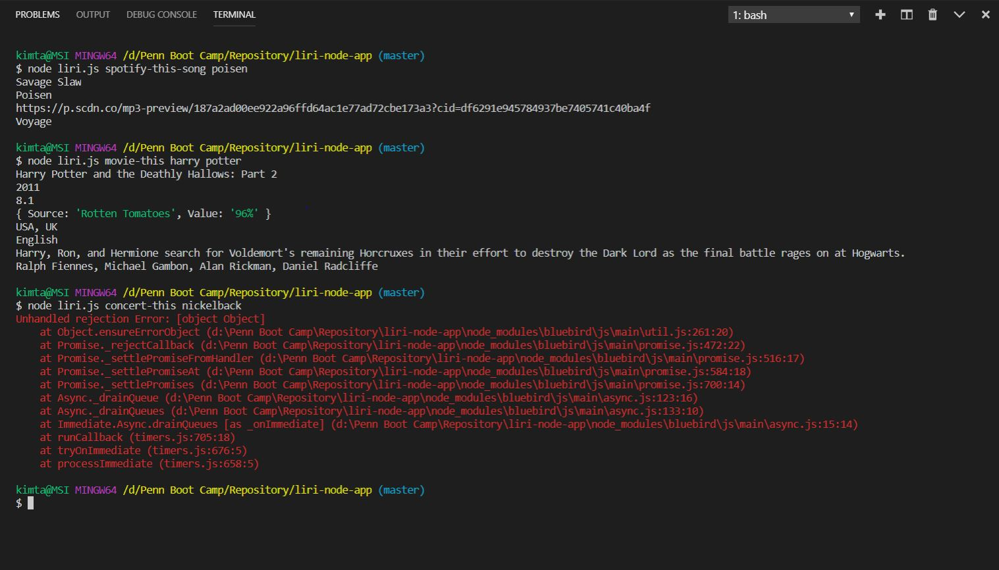
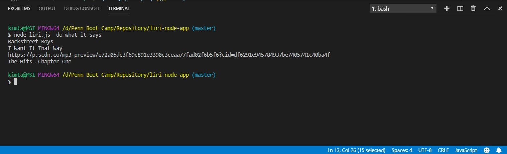

Here is the screenshot of my working app. The only thing is, for my "concert-this" switch case, for some reason it is not working anymore. It is giving me some weird error message about the bluebird js which is one of the node modules that was installed. I did not have this error before and am not sure how to fix it.

#All switch cases

Format: 

#Do-what-it-says

Format: 